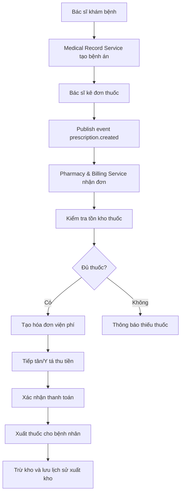
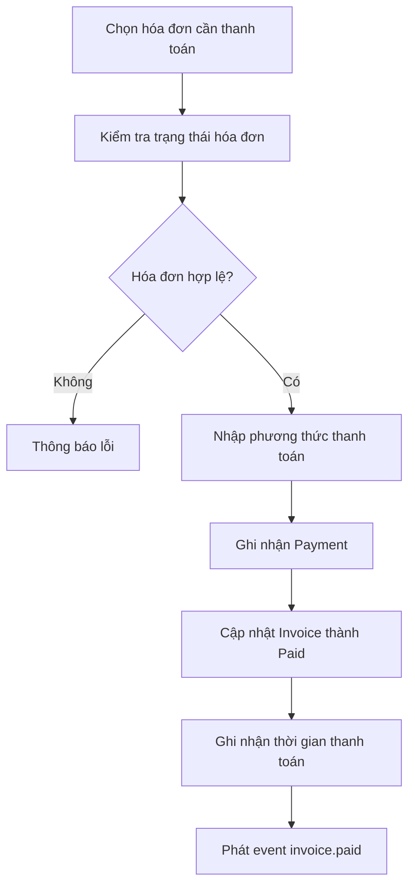

# Pharmacy & Billing Service

> Service thuộc đề tài **Hệ thống đặt lịch & quản lý phòng khám** theo kiến trúc **Microservices**.  
> Pharmacy & Billing Service phụ trách **JWT/Auth 4 vai trò, quản lý kho thuốc, nhận đơn thuốc, xuất thuốc, tính và thu viện phí**.

---

## 1. Tổng quan nghiệp vụ

**Pharmacy & Billing Service** là service xử lý phần **nhà thuốc và viện phí** trong hệ thống phòng khám.

Service này được sử dụng sau khi bệnh nhân đã được bác sĩ khám và kê đơn thuốc. Khi **Medical Record Service** tạo đơn thuốc, service này sẽ nhận thông tin đơn thuốc, kiểm tra tồn kho, xuất thuốc, tính tiền thuốc, cộng với phí khám và tạo hóa đơn thanh toán cho bệnh nhân.

### Mục tiêu chính

- Quản lý tài khoản và phân quyền người dùng.
- Quản lý danh mục thuốc.
- Quản lý tồn kho thuốc.
- Nhận đơn thuốc từ Medical Record Service.
- Xuất thuốc theo đơn.
- Tính viện phí gồm phí khám và tiền thuốc.
- Ghi nhận thanh toán.
- Theo dõi hóa đơn, công nợ và báo cáo doanh thu.

---

## 2. Vị trí trong kiến trúc Microservices

Hệ thống phòng khám gồm 3 service chính:

| Nhóm | Service | Database | Chức năng chính |
|---|---|---|---|
| Nhóm 1 | Appointment Service | AppointmentDB | Quản lý bác sĩ, lịch khám, hàng chờ |
| Nhóm 2 | Medical Record Service | MedicalDB | Hồ sơ bệnh nhân, bệnh án điện tử, kê đơn thuốc |
| Nhóm 3 | Pharmacy & Billing Service | PharmacyDB | JWT/Auth, kho thuốc, xuất thuốc, tính và thu viện phí |

### Nguyên tắc Microservices

- Mỗi service có database riêng.
- Không dùng foreign key chéo service.
- Service khác cần dữ liệu thì giao tiếp qua API hoặc event/message.
- JWT do một service cấp, các service còn lại validate token.
- Mỗi service deploy độc lập bằng Docker container.
- API Gateway là điểm vào duy nhất cho frontend.

---

## 3. Phạm vi nghiệp vụ

### 3.1. Nghiệp vụ thuộc Pharmacy & Billing Service

| Nhóm nghiệp vụ | Mô tả |
|---|---|
| Auth & User | Đăng nhập, cấp JWT, quản lý tài khoản, phân quyền |
| Medicine Management | Thêm, sửa, xóa, tìm kiếm thuốc |
| Inventory Management | Theo dõi tồn kho, nhập kho, xuất kho, cảnh báo thuốc sắp hết |
| Prescription Processing | Nhận đơn thuốc từ Medical Record Service |
| Dispensing | Cấp thuốc cho bệnh nhân theo đơn |
| Billing | Tính phí khám, tiền thuốc, tổng hóa đơn |
| Payment | Ghi nhận thanh toán bằng tiền mặt/chuyển khoản/thẻ |
| Report | Thống kê doanh thu, hóa đơn, thuốc bán nhiều |

### 3.2. Nghiệp vụ không thuộc service

| Nghiệp vụ | Service xử lý |
|---|---|
| Đặt lịch khám | Appointment Service |
| Quản lý lịch làm việc bác sĩ | Appointment Service |
| Xếp hàng chờ bệnh nhân | Appointment Service |
| Ghi bệnh án | Medical Record Service |
| Chẩn đoán bệnh | Medical Record Service |
| Kê đơn thuốc gốc | Medical Record Service |
| Quản lý hồ sơ bệnh nhân chi tiết | Medical Record Service |

Pharmacy & Billing Service chỉ lưu các ID tham chiếu như `PatientId`, `DoctorId`, `AppointmentId`, `MedicalRecordId`, `PrescriptionId`.

---

## 4. Vai trò người dùng

| Vai trò | Quyền hạn trong Pharmacy & Billing Service |
|---|---|
| Admin | Quản lý tài khoản, quản lý thuốc, quản lý kho, xem báo cáo tài chính |
| Doctor | Xem trạng thái đơn thuốc và hóa đơn liên quan đến ca khám |
| Receptionist/Nurse | Tạo hóa đơn, xác nhận thanh toán, in phiếu thu, cấp thuốc |
| Patient | Xem hóa đơn, xem đơn thuốc, xem trạng thái thanh toán |

---

## 5. Quy trình nghiệp vụ tổng quát



---

## 6. Quy trình đăng nhập và phân quyền

### Actor

- Admin
- Doctor
- Receptionist/Nurse
- Patient

### Luồng xử lý

1. Người dùng nhập email/tên đăng nhập và mật khẩu.
2. Hệ thống kiểm tra tài khoản.
3. Nếu hợp lệ, hệ thống tạo JWT token.
4. Token chứa thông tin:
   - `UserId`
   - `FullName`
   - `Email`
   - `Role`
   - `ExpiredAt`
5. Frontend lưu token và gọi API thông qua API Gateway.
6. Các API kiểm tra role trước khi xử lý nghiệp vụ.

### Trường hợp lỗi

| Lỗi | Cách xử lý |
|---|---|
| Sai email/mật khẩu | Trả về lỗi đăng nhập |
| Tài khoản bị khóa | Không cho đăng nhập |
| Token hết hạn | Yêu cầu đăng nhập lại |
| Không đủ quyền | Trả về `403 Forbidden` |

---

## 7. Quy trình quản lý thuốc

### Actor

- Admin
- Nhân viên được phân quyền quản lý kho

### Chức năng

- Thêm thuốc mới.
- Cập nhật thông tin thuốc.
- Ngừng kinh doanh thuốc.
- Tìm kiếm thuốc theo tên, hoạt chất, trạng thái.
- Cập nhật giá bán.
- Theo dõi số lượng tồn kho.
- Cảnh báo thuốc sắp hết.
- Cảnh báo thuốc gần hết hạn.

### Thông tin thuốc

| Thuộc tính | Ý nghĩa |
|---|---|
| `MedicineId` | Mã thuốc |
| `MedicineName` | Tên thuốc |
| `ActiveIngredient` | Hoạt chất |
| `Unit` | Đơn vị tính: viên, hộp, chai... |
| `Price` | Giá bán |
| `StockQuantity` | Số lượng tồn kho |
| `MinStockLevel` | Ngưỡng cảnh báo tồn kho thấp |
| `ExpiryDate` | Hạn sử dụng |
| `Status` | Trạng thái thuốc |

---

## 8. Quy trình nhận đơn thuốc

### Nguồn dữ liệu

Đơn thuốc được tạo từ **Medical Record Service** sau khi bác sĩ khám và kê đơn.

### Event nhận vào

```text
prescription.created
```

### Luồng xử lý

1. Medical Record Service publish event `prescription.created`.
2. Pharmacy & Billing Service consume event.
3. Lưu thông tin đơn thuốc vào `Prescriptions`.
4. Lưu danh sách thuốc vào `PrescriptionItems`.
5. Kiểm tra tồn kho từng thuốc.
6. Nếu đủ thuốc, trạng thái đơn thuốc là `ReadyToDispense`.
7. Nếu thiếu thuốc, trạng thái đơn thuốc là `OutOfStock` hoặc `PartiallyAvailable`.

### Ví dụ event

```json
{
  "PrescriptionId": 101,
  "PatientId": 25,
  "DoctorId": 7,
  "AppointmentId": 3001,
  "MedicalRecordId": 501,
  "Items": [
    {
      "MedicineId": 1,
      "MedicineName": "Paracetamol 500mg",
      "Quantity": 10,
      "Dosage": "Ngày uống 2 lần sau ăn"
    },
    {
      "MedicineId": 2,
      "MedicineName": "Vitamin C",
      "Quantity": 5,
      "Dosage": "Ngày uống 1 viên sau ăn sáng"
    }
  ]
}
```

---

## 9. Quy trình xuất thuốc

### Actor

- Receptionist
- Nurse
- Nhân viên nhà thuốc

### Luồng xử lý

1. Nhân viên mở đơn thuốc của bệnh nhân.
2. Hệ thống hiển thị danh sách thuốc cần cấp.
3. Hệ thống kiểm tra tồn kho và hạn sử dụng.
4. Nếu thuốc hợp lệ:
   - Trừ tồn kho.
   - Tạo phiếu xuất thuốc.
   - Lưu lịch sử xuất kho.
   - Cập nhật đơn thuốc thành `Dispensed`.
5. Nếu không hợp lệ:
   - Không cho xuất thuốc.
   - Hiển thị lý do lỗi.

### Quy tắc xuất thuốc

| Mã rule | Nội dung |
|---|---|
| BR-D01 | Không được xuất thuốc nếu tồn kho không đủ |
| BR-D02 | Không được xuất thuốc hết hạn |
| BR-D03 | Một đơn thuốc chỉ được xuất một lần |
| BR-D04 | Khi xuất thuốc phải tạo lịch sử kho |
| BR-D05 | Sau khi xuất thuốc phải cập nhật tồn kho |
| BR-D06 | Nếu tồn kho dưới ngưỡng tối thiểu thì cảnh báo |

---

## 10. Quy trình tính viện phí

### Công thức

```text
Tổng viện phí = Phí khám + Tổng tiền thuốc
```

```text
Tổng tiền thuốc = Số lượng thuốc x Đơn giá thuốc
```

### Ví dụ

| Khoản phí | Số lượng | Đơn giá | Thành tiền |
|---|---:|---:|---:|
| Phí khám | 1 | 150.000đ | 150.000đ |
| Paracetamol 500mg | 10 | 2.000đ | 20.000đ |
| Vitamin C | 5 | 6.000đ | 30.000đ |
| **Tổng tiền** |  |  | **200.000đ** |

### Nguồn dữ liệu

| Dữ liệu | Nguồn |
|---|---|
| Phí khám | Appointment Service hoặc lưu snapshot khi tạo hóa đơn |
| Đơn thuốc | Medical Record Service gửi qua event |
| Giá thuốc | PharmacyDB |
| Người bệnh | `PatientId` dạng reference ID |
| Bác sĩ | `DoctorId` dạng reference ID |

---

## 11. Quy trình tạo hóa đơn

### Actor

- Receptionist
- Nurse

### Luồng xử lý

1. Bệnh nhân hoàn tất khám.
2. Hệ thống nhận đơn thuốc.
3. Tiếp tân chọn tạo hóa đơn.
4. Hệ thống lấy phí khám.
5. Hệ thống lấy danh sách thuốc và giá thuốc.
6. Hệ thống tính:
   - `ExaminationFee`
   - `MedicineTotal`
   - `TotalAmount`
7. Tạo hóa đơn trạng thái `Unpaid`.
8. Bệnh nhân thanh toán.
9. Tiếp tân xác nhận thanh toán.
10. Hóa đơn chuyển trạng thái `Paid`.

### Trạng thái hóa đơn

| Trạng thái | Ý nghĩa |
|---|---|
| `Draft` | Hóa đơn mới tạo, chưa xác nhận |
| `Unpaid` | Đã tạo hóa đơn, chưa thanh toán |
| `Paid` | Đã thanh toán |
| `Cancelled` | Hóa đơn đã hủy |
| `Refunded` | Đã hoàn tiền |

---

## 12. Quy trình thanh toán

### Phương thức thanh toán

- Cash
- Banking
- Card
- Momo
- Other

### Luồng xử lý



### Quy tắc thanh toán

| Mã rule | Nội dung |
|---|---|
| BR-P01 | Chỉ hóa đơn `Unpaid` mới được thanh toán |
| BR-P02 | Không được thanh toán hóa đơn đã hủy |
| BR-P03 | Hóa đơn đã thanh toán không được sửa tổng tiền |
| BR-P04 | Mỗi lần thanh toán phải lưu bản ghi `Payment` |
| BR-P05 | Số tiền thanh toán phải bằng tổng tiền hóa đơn hoặc theo chính sách trả một phần |
| BR-P06 | Người xác nhận thanh toán phải là Receptionist/Nurse/Admin |

---

## 13. Thiết kế Database: PharmacyDB

> Lưu ý: Không tạo foreign key sang database của service khác.  
> Các trường như `PatientId`, `DoctorId`, `AppointmentId`, `MedicalRecordId`, `PrescriptionId` chỉ là reference ID.

---

### 13.1. Bảng `Users`

Quản lý tài khoản đăng nhập.

| Cột | Kiểu dữ liệu | Ghi chú |
|---|---|---|
| `UserId` | int | Primary key |
| `FullName` | nvarchar(100) | Họ tên |
| `Email` | nvarchar(100) | Unique |
| `PasswordHash` | nvarchar(255) | Mật khẩu đã hash |
| `Role` | nvarchar(30) | Admin, Doctor, Receptionist, Nurse, Patient |
| `Status` | nvarchar(20) | Active, Locked |
| `CreatedAt` | datetime | Ngày tạo |
| `UpdatedAt` | datetime | Ngày cập nhật |

---

### 13.2. Bảng `Medicines`

Quản lý danh mục thuốc.

| Cột | Kiểu dữ liệu | Ghi chú |
|---|---|---|
| `MedicineId` | int | Primary key |
| `MedicineName` | nvarchar(150) | Tên thuốc |
| `ActiveIngredient` | nvarchar(150) | Hoạt chất |
| `Unit` | nvarchar(50) | Đơn vị tính |
| `Price` | decimal(18,2) | Giá bán |
| `StockQuantity` | int | Số lượng tồn |
| `MinStockLevel` | int | Ngưỡng cảnh báo |
| `ExpiryDate` | date | Hạn sử dụng |
| `Status` | nvarchar(30) | Active, Inactive, OutOfStock |
| `CreatedAt` | datetime | Ngày tạo |
| `UpdatedAt` | datetime | Ngày cập nhật |

---

### 13.3. Bảng `Prescriptions`

Lưu đơn thuốc được nhận từ Medical Record Service.

| Cột | Kiểu dữ liệu | Ghi chú |
|---|---|---|
| `PrescriptionId` | int | ID từ Medical Record Service |
| `PatientId` | int | Reference ID |
| `DoctorId` | int | Reference ID |
| `AppointmentId` | int | Reference ID |
| `MedicalRecordId` | int | Reference ID |
| `Status` | nvarchar(30) | Pending, ReadyToDispense, Dispensed, OutOfStock |
| `CreatedAt` | datetime | Ngày nhận đơn |

---

### 13.4. Bảng `PrescriptionItems`

Chi tiết thuốc trong đơn.

| Cột | Kiểu dữ liệu | Ghi chú |
|---|---|---|
| `PrescriptionItemId` | int | Primary key |
| `PrescriptionId` | int | Mã đơn thuốc |
| `MedicineId` | int | Mã thuốc |
| `MedicineName` | nvarchar(150) | Tên thuốc snapshot |
| `Quantity` | int | Số lượng |
| `Dosage` | nvarchar(255) | Cách dùng |
| `UnitPrice` | decimal(18,2) | Giá tại thời điểm lập hóa đơn |
| `TotalPrice` | decimal(18,2) | Thành tiền |

---

### 13.5. Bảng `Invoices`

Quản lý hóa đơn viện phí.

| Cột | Kiểu dữ liệu | Ghi chú |
|---|---|---|
| `InvoiceId` | int | Primary key |
| `PatientId` | int | Reference ID |
| `AppointmentId` | int | Reference ID |
| `PrescriptionId` | int | Reference ID |
| `ExaminationFee` | decimal(18,2) | Phí khám |
| `MedicineTotal` | decimal(18,2) | Tổng tiền thuốc |
| `TotalAmount` | decimal(18,2) | Tổng tiền |
| `Status` | nvarchar(30) | Draft, Unpaid, Paid, Cancelled, Refunded |
| `CreatedAt` | datetime | Ngày tạo |
| `PaidAt` | datetime | Ngày thanh toán |

---

### 13.6. Bảng `Payments`

Ghi nhận giao dịch thanh toán.

| Cột | Kiểu dữ liệu | Ghi chú |
|---|---|---|
| `PaymentId` | int | Primary key |
| `InvoiceId` | int | Mã hóa đơn |
| `Amount` | decimal(18,2) | Số tiền thanh toán |
| `PaymentMethod` | nvarchar(30) | Cash, Banking, Card, Momo |
| `PaymentStatus` | nvarchar(30) | Success, Failed, Pending |
| `PaidBy` | int | UserId người thu |
| `PaidAt` | datetime | Thời gian thanh toán |
| `Note` | nvarchar(255) | Ghi chú |

---

### 13.7. Bảng `StockTransactions`

Lưu lịch sử nhập/xuất/điều chỉnh kho.

| Cột | Kiểu dữ liệu | Ghi chú |
|---|---|---|
| `TransactionId` | int | Primary key |
| `MedicineId` | int | Mã thuốc |
| `Type` | nvarchar(30) | Import, Export, Adjust |
| `Quantity` | int | Số lượng thay đổi |
| `BeforeQuantity` | int | Tồn trước |
| `AfterQuantity` | int | Tồn sau |
| `Reason` | nvarchar(255) | Lý do |
| `CreatedBy` | int | UserId người thao tác |
| `CreatedAt` | datetime | Ngày tạo |

---

## 14. Gợi ý SQL Server Schema

```sql
CREATE DATABASE PharmacyDB;
GO

USE PharmacyDB;
GO

CREATE TABLE Users (
    UserId INT IDENTITY(1,1) PRIMARY KEY,
    FullName NVARCHAR(100) NOT NULL,
    Email NVARCHAR(100) NOT NULL UNIQUE,
    PasswordHash NVARCHAR(255) NOT NULL,
    Role NVARCHAR(30) NOT NULL CHECK (Role IN ('Admin', 'Doctor', 'Receptionist', 'Nurse', 'Patient')),
    Status NVARCHAR(20) NOT NULL DEFAULT 'Active' CHECK (Status IN ('Active', 'Locked')),
    CreatedAt DATETIME NOT NULL DEFAULT GETDATE(),
    UpdatedAt DATETIME NULL
);

CREATE TABLE Medicines (
    MedicineId INT IDENTITY(1,1) PRIMARY KEY,
    MedicineName NVARCHAR(150) NOT NULL,
    ActiveIngredient NVARCHAR(150) NULL,
    Unit NVARCHAR(50) NOT NULL,
    Price DECIMAL(18,2) NOT NULL CHECK (Price >= 0),
    StockQuantity INT NOT NULL DEFAULT 0 CHECK (StockQuantity >= 0),
    MinStockLevel INT NOT NULL DEFAULT 10 CHECK (MinStockLevel >= 0),
    ExpiryDate DATE NULL,
    Status NVARCHAR(30) NOT NULL DEFAULT 'Active'
        CHECK (Status IN ('Active', 'Inactive', 'OutOfStock')),
    CreatedAt DATETIME NOT NULL DEFAULT GETDATE(),
    UpdatedAt DATETIME NULL
);

CREATE TABLE Prescriptions (
    PrescriptionId INT PRIMARY KEY,
    PatientId INT NOT NULL,
    DoctorId INT NOT NULL,
    AppointmentId INT NULL,
    MedicalRecordId INT NULL,
    Status NVARCHAR(30) NOT NULL DEFAULT 'Pending'
        CHECK (Status IN ('Pending', 'ReadyToDispense', 'Dispensed', 'OutOfStock', 'PartiallyAvailable')),
    CreatedAt DATETIME NOT NULL DEFAULT GETDATE()
);

CREATE TABLE PrescriptionItems (
    PrescriptionItemId INT IDENTITY(1,1) PRIMARY KEY,
    PrescriptionId INT NOT NULL,
    MedicineId INT NOT NULL,
    MedicineName NVARCHAR(150) NOT NULL,
    Quantity INT NOT NULL CHECK (Quantity > 0),
    Dosage NVARCHAR(255) NULL,
    UnitPrice DECIMAL(18,2) NOT NULL DEFAULT 0 CHECK (UnitPrice >= 0),
    TotalPrice AS (Quantity * UnitPrice) PERSISTED,
    CONSTRAINT FK_PrescriptionItems_Prescriptions
        FOREIGN KEY (PrescriptionId) REFERENCES Prescriptions(PrescriptionId),
    CONSTRAINT FK_PrescriptionItems_Medicines
        FOREIGN KEY (MedicineId) REFERENCES Medicines(MedicineId)
);

CREATE TABLE Invoices (
    InvoiceId INT IDENTITY(1,1) PRIMARY KEY,
    PatientId INT NOT NULL,
    AppointmentId INT NULL,
    PrescriptionId INT NULL,
    ExaminationFee DECIMAL(18,2) NOT NULL DEFAULT 0 CHECK (ExaminationFee >= 0),
    MedicineTotal DECIMAL(18,2) NOT NULL DEFAULT 0 CHECK (MedicineTotal >= 0),
    TotalAmount DECIMAL(18,2) NOT NULL DEFAULT 0 CHECK (TotalAmount >= 0),
    Status NVARCHAR(30) NOT NULL DEFAULT 'Unpaid'
        CHECK (Status IN ('Draft', 'Unpaid', 'Paid', 'Cancelled', 'Refunded')),
    CreatedAt DATETIME NOT NULL DEFAULT GETDATE(),
    PaidAt DATETIME NULL,
    CONSTRAINT FK_Invoices_Prescriptions
        FOREIGN KEY (PrescriptionId) REFERENCES Prescriptions(PrescriptionId)
);

CREATE TABLE Payments (
    PaymentId INT IDENTITY(1,1) PRIMARY KEY,
    InvoiceId INT NOT NULL,
    Amount DECIMAL(18,2) NOT NULL CHECK (Amount > 0),
    PaymentMethod NVARCHAR(30) NOT NULL
        CHECK (PaymentMethod IN ('Cash', 'Banking', 'Card', 'Momo', 'Other')),
    PaymentStatus NVARCHAR(30) NOT NULL DEFAULT 'Success'
        CHECK (PaymentStatus IN ('Success', 'Failed', 'Pending')),
    PaidBy INT NOT NULL,
    PaidAt DATETIME NOT NULL DEFAULT GETDATE(),
    Note NVARCHAR(255) NULL,
    CONSTRAINT FK_Payments_Invoices
        FOREIGN KEY (InvoiceId) REFERENCES Invoices(InvoiceId)
);

CREATE TABLE StockTransactions (
    TransactionId INT IDENTITY(1,1) PRIMARY KEY,
    MedicineId INT NOT NULL,
    Type NVARCHAR(30) NOT NULL CHECK (Type IN ('Import', 'Export', 'Adjust')),
    Quantity INT NOT NULL CHECK (Quantity > 0),
    BeforeQuantity INT NOT NULL CHECK (BeforeQuantity >= 0),
    AfterQuantity INT NOT NULL CHECK (AfterQuantity >= 0),
    Reason NVARCHAR(255) NULL,
    CreatedBy INT NULL,
    CreatedAt DATETIME NOT NULL DEFAULT GETDATE(),
    CONSTRAINT FK_StockTransactions_Medicines
        FOREIGN KEY (MedicineId) REFERENCES Medicines(MedicineId)
);
```

---

## 15. API đề xuất

### 15.1. Auth API

| Method | Endpoint | Role | Chức năng |
|---|---|---|---|
| POST | `/api/auth/login` | Public | Đăng nhập |
| POST | `/api/auth/register` | Admin | Tạo tài khoản |
| GET | `/api/auth/profile` | Authenticated | Xem thông tin cá nhân |
| GET | `/api/auth/users` | Admin | Danh sách người dùng |
| PUT | `/api/auth/users/{id}/lock` | Admin | Khóa tài khoản |
| PUT | `/api/auth/users/{id}/unlock` | Admin | Mở khóa tài khoản |

---

### 15.2. Medicine API

| Method | Endpoint | Role | Chức năng |
|---|---|---|---|
| GET | `/api/medicines` | Admin, Nurse, Receptionist, Doctor | Danh sách thuốc |
| GET | `/api/medicines/{id}` | Admin, Nurse, Receptionist, Doctor | Chi tiết thuốc |
| POST | `/api/medicines` | Admin | Thêm thuốc |
| PUT | `/api/medicines/{id}` | Admin | Cập nhật thuốc |
| DELETE | `/api/medicines/{id}` | Admin | Xóa/ngừng bán thuốc |
| GET | `/api/medicines/low-stock` | Admin, Nurse | Danh sách thuốc sắp hết |
| GET | `/api/medicines/expired` | Admin, Nurse | Danh sách thuốc hết hạn |

---

### 15.3. Inventory API

| Method | Endpoint | Role | Chức năng |
|---|---|---|---|
| POST | `/api/inventory/import` | Admin, Nurse | Nhập kho |
| POST | `/api/inventory/adjust` | Admin | Điều chỉnh kho |
| GET | `/api/inventory/transactions` | Admin, Nurse | Lịch sử nhập/xuất kho |
| GET | `/api/inventory/transactions/{medicineId}` | Admin, Nurse | Lịch sử của một thuốc |

---

### 15.4. Prescription API

| Method | Endpoint | Role | Chức năng |
|---|---|---|---|
| GET | `/api/prescriptions` | Admin, Nurse, Receptionist | Danh sách đơn thuốc |
| GET | `/api/prescriptions/{id}` | Admin, Nurse, Receptionist, Doctor | Chi tiết đơn thuốc |
| GET | `/api/prescriptions/patient/{patientId}` | Admin, Nurse, Receptionist, Patient | Đơn thuốc của bệnh nhân |
| POST | `/api/prescriptions/{id}/dispense` | Nurse, Receptionist | Xuất thuốc |

---

### 15.5. Billing API

| Method | Endpoint | Role | Chức năng |
|---|---|---|---|
| POST | `/api/invoices` | Receptionist, Nurse | Tạo hóa đơn |
| GET | `/api/invoices` | Admin, Receptionist, Nurse | Danh sách hóa đơn |
| GET | `/api/invoices/{id}` | Admin, Receptionist, Nurse, Patient | Chi tiết hóa đơn |
| POST | `/api/invoices/{id}/pay` | Receptionist, Nurse | Thanh toán hóa đơn |
| PUT | `/api/invoices/{id}/cancel` | Admin, Receptionist | Hủy hóa đơn |
| GET | `/api/invoices/patient/{patientId}` | Patient, Admin, Receptionist | Hóa đơn của bệnh nhân |

---

### 15.6. Report API

| Method | Endpoint | Role | Chức năng |
|---|---|---|---|
| GET | `/api/reports/revenue/daily` | Admin | Doanh thu theo ngày |
| GET | `/api/reports/revenue/monthly` | Admin | Doanh thu theo tháng |
| GET | `/api/reports/top-medicines` | Admin | Thuốc bán nhiều |
| GET | `/api/reports/unpaid-invoices` | Admin, Receptionist | Hóa đơn chưa thanh toán |
| GET | `/api/reports/low-stock` | Admin, Nurse | Báo cáo thuốc sắp hết |

---

## 16. Event nghiệp vụ

### 16.1. Event nhận vào

#### `prescription.created`

Nguồn: Medical Record Service

Mục đích:

- Nhận đơn thuốc mới.
- Lưu đơn thuốc.
- Kiểm tra tồn kho.
- Chuẩn bị xuất thuốc.
- Tạo dữ liệu tính tiền thuốc.

```json
{
  "EventName": "prescription.created",
  "PrescriptionId": 101,
  "PatientId": 25,
  "DoctorId": 7,
  "AppointmentId": 3001,
  "MedicalRecordId": 501,
  "CreatedAt": "2026-05-28T10:00:00",
  "Items": [
    {
      "MedicineId": 1,
      "MedicineName": "Paracetamol 500mg",
      "Quantity": 10,
      "Dosage": "Ngày uống 2 lần sau ăn"
    }
  ]
}
```

---

### 16.2. Event phát ra

#### `medicine.stock.updated`

Phát ra khi tồn kho thuốc thay đổi.

```json
{
  "EventName": "medicine.stock.updated",
  "MedicineId": 1,
  "BeforeQuantity": 100,
  "AfterQuantity": 90,
  "UpdatedAt": "2026-05-28T10:30:00"
}
```

#### `medicine.dispensed`

Phát ra khi thuốc đã được cấp cho bệnh nhân.

```json
{
  "EventName": "medicine.dispensed",
  "PrescriptionId": 101,
  "PatientId": 25,
  "DispensedAt": "2026-05-28T10:35:00"
}
```

#### `invoice.paid`

Phát ra khi hóa đơn thanh toán thành công.

```json
{
  "EventName": "invoice.paid",
  "InvoiceId": 5001,
  "PatientId": 25,
  "TotalAmount": 200000,
  "PaymentMethod": "Cash",
  "PaidAt": "2026-05-28T10:40:00"
}
```

---

## 17. Business Rules tổng hợp

| Mã rule | Quy tắc |
|---|---|
| BR01 | Chỉ Admin được thêm, sửa, xóa thuốc |
| BR02 | Receptionist/Nurse được tạo hóa đơn và thu tiền |
| BR03 | Patient chỉ được xem hóa đơn và đơn thuốc của chính mình |
| BR04 | Không cho xuất thuốc nếu tồn kho không đủ |
| BR05 | Không cho xuất thuốc hết hạn |
| BR06 | Một đơn thuốc chỉ được xuất một lần |
| BR07 | Hóa đơn đã thanh toán không được sửa tổng tiền |
| BR08 | Hóa đơn đã hủy không được thanh toán |
| BR09 | Thanh toán thành công phải tạo bản ghi `Payment` |
| BR10 | Xuất thuốc phải tạo bản ghi `StockTransaction` |
| BR11 | Tổng tiền hóa đơn = phí khám + tổng tiền thuốc |
| BR12 | Giá thuốc trong hóa đơn phải lưu cố định tại thời điểm tạo hóa đơn |
| BR13 | Không cho tồn kho âm |
| BR14 | Thuốc có `StockQuantity = 0` chuyển trạng thái `OutOfStock` |
| BR15 | Khi tồn kho dưới `MinStockLevel`, hệ thống cần cảnh báo |
| BR16 | Không được xóa cứng thuốc đã phát sinh đơn thuốc |
| BR17 | Không tạo hóa đơn trùng cho cùng một đơn thuốc |
| BR18 | Chỉ tài khoản Active mới được đăng nhập |

---

## 18. Yêu cầu phi chức năng

| Nhóm yêu cầu | Mô tả |
|---|---|
| Bảo mật | Sử dụng JWT Bearer Token, phân quyền theo role |
| Hiệu năng | API danh sách cần phân trang, tìm kiếm, lọc |
| Tính đúng đắn | Không âm kho, không tính sai hóa đơn |
| Audit | Lưu lịch sử thanh toán và lịch sử kho |
| Độc lập service | Không phụ thuộc database service khác |
| Tài liệu API | Có Swagger/OpenAPI |
| Deploy | Chạy độc lập bằng Docker |
| Khả dụng | Service khác down thì service vẫn chạy được các chức năng nội bộ |

---

## 19. Gợi ý cấu trúc project ASP.NET Core Web API

```text
PharmacyBillingService/
│
├── Controllers/
│   ├── AuthController.cs
│   ├── MedicinesController.cs
│   ├── InventoryController.cs
│   ├── PrescriptionsController.cs
│   ├── InvoicesController.cs
│   ├── PaymentsController.cs
│   └── ReportsController.cs
│
├── Data/
│   └── PharmacyDbContext.cs
│
├── DTOs/
│   ├── Auth/
│   ├── Medicines/
│   ├── Prescriptions/
│   ├── Invoices/
│   └── Payments/
│
├── Models/
│   ├── User.cs
│   ├── Medicine.cs
│   ├── Prescription.cs
│   ├── PrescriptionItem.cs
│   ├── Invoice.cs
│   ├── Payment.cs
│   └── StockTransaction.cs
│
├── Services/
│   ├── AuthService.cs
│   ├── MedicineService.cs
│   ├── InventoryService.cs
│   ├── PrescriptionService.cs
│   ├── BillingService.cs
│   ├── PaymentService.cs
│   └── ReportService.cs
│
├── Events/
│   ├── PrescriptionCreatedEvent.cs
│   ├── InvoicePaidEvent.cs
│   └── MedicineStockUpdatedEvent.cs
│
├── Helpers/
│   ├── JwtHelper.cs
│   └── PasswordHasher.cs
│
├── appsettings.json
├── Program.cs
└── Dockerfile
```

---

## 20. Gợi ý màn hình Frontend

### Admin

- Dashboard doanh thu.
- Quản lý tài khoản.
- Quản lý danh mục thuốc.
- Quản lý tồn kho.
- Báo cáo thuốc sắp hết.
- Báo cáo hóa đơn chưa thanh toán.

### Receptionist/Nurse

- Danh sách bệnh nhân chờ thanh toán.
- Chi tiết đơn thuốc.
- Tạo hóa đơn.
- Xác nhận thanh toán.
- In phiếu thu.
- Xuất thuốc.

### Doctor

- Xem trạng thái đơn thuốc đã kê.
- Xem hóa đơn liên quan ca khám.

### Patient

- Xem hóa đơn.
- Xem trạng thái thanh toán.
- Xem đơn thuốc cũ.

---

## 21. Test case nghiệp vụ

| Mã test | Tình huống | Kết quả mong đợi |
|---|---|---|
| TC01 | Đăng nhập đúng tài khoản | Trả về JWT token |
| TC02 | Đăng nhập sai mật khẩu | Báo lỗi |
| TC03 | Admin thêm thuốc mới | Thuốc được lưu vào database |
| TC04 | User không phải Admin thêm thuốc | Trả về 403 |
| TC05 | Nhận event đơn thuốc mới | Tạo Prescription và PrescriptionItems |
| TC06 | Xuất thuốc đủ tồn kho | Trừ kho và cập nhật trạng thái Dispensed |
| TC07 | Xuất thuốc không đủ tồn kho | Không cho xuất thuốc |
| TC08 | Xuất thuốc hết hạn | Không cho xuất thuốc |
| TC09 | Tạo hóa đơn từ đơn thuốc | Tính đúng phí khám + tiền thuốc |
| TC10 | Thanh toán hóa đơn Unpaid | Tạo Payment và chuyển Invoice thành Paid |
| TC11 | Thanh toán hóa đơn Paid | Không cho thanh toán lại |
| TC12 | Hủy hóa đơn đã thanh toán | Không cho hủy hoặc yêu cầu quy trình hoàn tiền |
| TC13 | Xem báo cáo doanh thu ngày | Trả về tổng doanh thu trong ngày |
| TC14 | Tồn kho dưới ngưỡng | Hiển thị trong danh sách low-stock |

---

## 22. Rủi ro và hướng xử lý

| Rủi ro | Hướng xử lý |
|---|---|
| Event `prescription.created` bị gửi trùng | Kiểm tra `PrescriptionId` trước khi insert |
| Giá thuốc thay đổi sau khi tạo hóa đơn | Lưu `UnitPrice` snapshot trong `PrescriptionItems` |
| Xuất thuốc nhiều lần cho một đơn | Kiểm tra trạng thái `Dispensed` |
| Tồn kho bị âm khi nhiều người xuất cùng lúc | Dùng transaction và kiểm tra tồn kho trước khi update |
| Service khác bị down | Lưu reference ID và xử lý lại khi service hoạt động |
| Hóa đơn bị tính sai | Tính lại từ chi tiết thuốc, kiểm tra bằng test case |
| Mất dấu lịch sử kho | Bắt buộc tạo `StockTransaction` khi nhập/xuất/điều chỉnh |

---

## 23. Kết luận

**Pharmacy & Billing Service** là service quan trọng ở cuối quy trình khám bệnh, xử lý hai phần chính là **thuốc** và **tiền**.

Service này cần đảm bảo:

- Phân quyền rõ ràng cho 4 vai trò.
- Quản lý thuốc và tồn kho chính xác.
- Nhận đơn thuốc từ Medical Record Service.
- Xuất thuốc không làm âm kho.
- Tính hóa đơn đúng theo phí khám và tiền thuốc.
- Ghi nhận thanh toán minh bạch.
- Lưu lịch sử kho và lịch sử thanh toán để truy vết.
- Không tạo foreign key chéo database với service khác.

Khi triển khai đúng, service này giúp phòng khám quản lý tốt nhà thuốc, giảm sai sót khi thu viện phí và hỗ trợ báo cáo tài chính hiệu quả.
